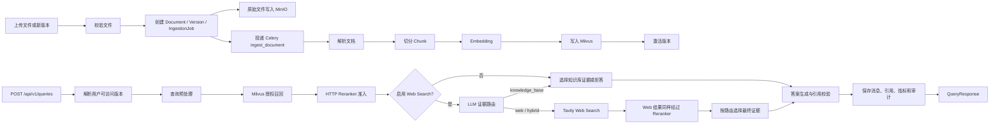

# RAG 模块说明

本文只说明当前项目中的 RAG 链路。认证、通用文档管理、Streamlit 页面和部署细节只在影响 RAG 边界时提及。

## 范围

RAG 子系统包含：

- 文档校验、解析、切分、Embedding 和 Milvus 索引。
- 基于当前用户授权范围的活跃文档版本检索。
- 查询预处理，包括 normalize、direct、HyDE、step_back 和 multi_query。
- Milvus 召回后的专业 HTTP Reranker 准入。
- 证据不足时的结构化拒答。
- Tavily 真实 Web Search 降级链路。
- 答案生成、引用校验、会话持久化、诊断指标和审计记录。

当前正常查询路径不再逐 Chunk 调用 LLM 做相关性评分。LLM 相关性评分代码仅保留给 `RERANKER_FAILURE_STRATEGY=llm` 故障回退使用。

## 主要文件

- `app/rag/service.py`：`RAGService` 和 LangGraph 主链路，负责编排查询预处理、检索、Reranker、Web Search、证据选择、生成、引用和持久化。
- `app/rag/rerankers.py`：候选重排实现，包括本地默认策略、透传策略和外部 HTTP Reranker。
- `app/rag/model_gateway.py`：LLM 调用入口，负责查询改写、证据路由、答案生成，以及故障回退时的 LLM 相关性评分。
- `app/rag/preprocessors.py`：查询预处理策略组合。
- `app/rag/web_search.py`：Tavily HTTP provider、重试策略和 Web 结果标准化。
- `app/rag/types.py`：RAG 状态和组件协议。
- `app/rag/utils.py`：查询规范化、候选合并、引用解析、耗时记录等工具。
- `app/vector_store.py`：Milvus collection、Embedding、授权过滤检索、向量写入和清理。
- `app/repositories.py`：根据当前用户解析可访问的活跃文档版本。
- `app/ingestion.py`：抽取文档文本并构建 chunk 元数据。
- `app/tasks.py`：Celery 文档入库和向量清理任务。
- `app/api.py`：上传、文档、任务、会话和问答 API。
- `app/config.py`：RAG、模型、Reranker、Web Search 和 LangSmith 配置。
- `app/models.py`：文档、版本、任务、会话、消息、引用、指标和审计日志模型。

## 总体链路



## 文档入库路径

1. 上传接口读取文件，校验归属和部门边界，创建文档版本与入库任务。
2. 原始文件写入 MinIO，业务元数据写入 MySQL。
3. Celery Worker 执行 `ingest_document`，依次进入 `parsing`、`embedding`、`indexing`、`activating`、`ready` 阶段。
4. `parse_document` 支持 PDF、TXT 和 Markdown。
5. `build_chunks` 使用 `RecursiveCharacterTextSplitter`，切分参数来自 `CHUNK_SIZE` 和 `CHUNK_OVERLAP`。
6. Chunk ID 使用确定性格式：`document_uuid:version_number:chunk_index`。
7. `MilvusChunkStore.insert_chunks` 对 chunk 文本做 Embedding，并写入向量和检索元数据。
8. 只有 Milvus 写入成功后才激活新版本；失败时旧版本继续可检索。

## 查询与生成路径

1. `POST /api/v1/queries` 只接收 `question` 和可选 `conversation_uuid`。客户端不能传部门 ID、文档 ID 或 Milvus 过滤表达式。
2. `RAGService.answer` 通过 `active_versions_for_user` 获取当前用户可访问的活跃版本 UUID。MySQL 是授权事实来源。
3. `preprocess_query` 生成检索查询列表。用户原始问题保持不变，用于最终答案生成。
4. `retrieve` 对预处理后的查询逐个执行 Milvus 检索，并应用 `version_uuid in [...]` 授权过滤。
5. 多查询召回结果按 `chunk_id` 合并，同一个 chunk 保留最高向量分数。
6. `grade_documents` 节点现在实际执行的是 Reranker 准入：外部 Reranker 打分、阈值过滤、Top-K 截断。
7. Web Search 关闭时，知识库证据达到 `RAG_MIN_RELEVANT_DOCUMENTS` 后直接生成，否则返回结构化拒答。
8. Web Search 开启时，`route_evidence` 让 LLM 在 `knowledge_base`、`web`、`hybrid` 中选择证据路线。
9. `web` 和 `hybrid` 路由调用 Tavily。默认只使用规范化原问题搜索一次，以控制费用和延迟。
10. Web 候选与知识库候选使用同一套 Reranker 准入规则。
11. `generate` 根据最终证据生成答案，并校验答案中的 `[n]` 引用。
12. 无引用、引用越界或重试后仍无有效引用时，返回 `invalid_citations` 拒答。
13. 查询完成后保存用户消息、助手消息、引用、耗时指标、RAG diagnostics 和审计日志。

## 授权不变量

- Milvus 检索前，必须先由 MySQL 解析出当前用户可访问的活跃版本 UUID。
- 用户只能检索自己有权访问的活跃文档版本。
- 管理员可访问所有未删除文档；普通用户可访问自己拥有、部门可见、用户 ACL 授权或部门 ACL 授权的文档。
- 查询客户端无法扩大检索范围。
- Reranker、Web Search 和答案生成都不能绕过 MySQL 授权边界。
- Web 结果不具备企业知识库授权语义，引用中必须标记为 `source_type=web`。

## 查询预处理

`QUERY_REWRITE_TYPES` 支持按顺序组合以下策略：

| 策略 | 作用 | 额外开销 | 适合场景 |
| --- | --- | --- | --- |
| `normalize` | 本地清洗空白字符 | 无 LLM 调用 | 所有查询 |
| `direct` | 将口语化或指代不清的问题改写成独立问题 | 1 次 LLM 调用 | 短问题、上下文依赖问题 |
| `hyde` | 生成假想答案文档用于检索 | 1 次 LLM 调用 | 查询表达和文档表达差异较大的知识库 |
| `step_back` | 生成更抽象的背景问题 | 1 次 LLM 调用 | 原理、制度、技术背景类问题 |
| `multi_query` | 生成多个检索角度 | 1 次 LLM 调用 | 涉及多个维度的复杂问题 |

补充规则：

- `standalone` 是 `direct` 的兼容别名。
- 第一条查询始终是 normalize 后的用户原问题。
- 查询按规范化文本去重。
- 初始检索最多使用 `QUERY_REWRITE_MAX_QUERIES` 个查询。
- 查询改写失败时保留 normalize 后的原问题，不中断 RAG 请求。
- 所有改写查询只用于检索，最终生成仍使用用户原问题。

## Reranker 准入

当前正常主链路为：

```text
Milvus 召回 -> 外部 HTTP Reranker -> RERANKER_MIN_SCORE 过滤 -> RERANKER_TOP_K 截断 -> 证据选择 -> 答案生成
```

默认配置：

```dotenv
RERANKER_TYPE=external
RERANKER_ENDPOINT=
RERANKER_MODEL=
RERANKER_MIN_SCORE=0.5
RERANKER_TOP_K=6
RERANKER_FAILURE_STRATEGY=reject
```

`RELEVANCE_GRADING_ENABLED` 已废弃，不再控制正常查询链路。正常路径下，Reranker 成功时不会调用 LLM 相关性评分。

### HTTP 合约

请求格式：

```json
{
  "model": "reranker-model",
  "query": "用户问题",
  "documents": ["chunk 1", "chunk 2"]
}
```

响应支持 `results` 或 `data`：

```json
{
  "results": [
    {"index": 1, "relevance_score": 0.92}
  ]
}
```

约束：

- 分数必须是 `0-1` 之间的有限数字。
- `index` 必须在候选列表范围内。
- 不允许重复 index。
- 缺少 `results/data`、非数字、NaN、越界、重复 index、HTTP 错误或超时都视为 Reranker 故障。
- 合法空数组表示没有相关证据，不会强行选择 Top-K。

### 故障策略

`RERANKER_FAILURE_STRATEGY` 支持三种策略：

- `reject`：默认策略。Reranker 故障时拒答，`refusal_detail=reranker_failed`。
- `vector`：使用 Milvus 向量分数和 `RETRIEVAL_MIN_SCORE` 过滤，再应用 Top-K。选择该策略时必须配置 `RETRIEVAL_MIN_SCORE`。
- `llm`：仅在 Reranker 故障时调用旧的 Pydantic LLM 相关性评分。

`/health/ready` 只检查 Reranker 配置完整性，不发送付费推理探针。`RERANKER_ENDPOINT` 或 `RERANKER_MODEL` 缺失时，readiness 返回 503，并标记 `reranker=unavailable`。

## Web Search 降级

`WEB_SEARCH_ENABLED=true` 是默认值。系统使用 Tavily 作为真实外部搜索 provider；关闭后只使用授权知识库证据。

开启后：

- 知识库 Reranker 完成后，`route_evidence` 返回 `knowledge_base`、`web` 或 `hybrid`。
- `knowledge_base` 表示知识库证据足够，不调用 Web Search。
- `web` 表示只使用 Web 证据。
- `hybrid` 表示同时使用知识库和 Web 证据，任一侧缺失都会拒答。
- Tavily 默认使用 `basic` 搜索深度、单查询和最多 5 条结果。
- Tavily 只接收搜索问题，不发送知识库 chunk、用户身份、ACL 或会话历史。
- 外部搜索会产生费用并造成问题文本出域，生产环境必须使用企业密钥管理和审计策略。
- Tavily 超时、限流、5xx 或响应非法时保守拒答，`refusal_detail=web_search_failed`。
- Mock provider 不再作为运行时配置，只保留给测试和离线 Fake 注入。
- Web 候选同样必须通过 Reranker 阈值和 Top-K 准入。

## 引用与拒答

答案必须包含 `[n]` 形式引用。系统只返回答案中实际引用的证据。

知识库引用包含：

- `source_type=knowledge_base`
- `document_uuid`
- `document_title`
- `version`
- `page_number`
- `chunk_id`
- `excerpt`

Web 引用包含：

- `source_type=web`
- `url`
- `document_title`
- `chunk_id`
- `excerpt`

常见拒答详情：

- `no_authorized_documents`：当前用户没有可访问文档。
- `no_retrieval_queries`：查询预处理后没有有效查询。
- `no_retrieval_results`：Milvus 没有召回候选。
- `no_relevant_evidence`：召回候选未通过 Reranker。
- `reranker_failed`：Reranker 故障且策略为 `reject`。
- `no_web_results`：Web Search 没有候选。
- `web_search_failed`：Tavily 超时、限流、HTTP 错误或返回非法响应。
- `no_relevant_web_evidence`：Web 候选未通过 Reranker。
- `insufficient_hybrid_evidence`：hybrid 路由缺少某一侧证据。
- `invalid_citations`：答案缺少有效引用或引用越界。
- `evidence_routing_failed`：证据路由失败。

## 可观测性

每次查询会在 `messages.metrics` 中保存：

- `timings`：各阶段耗时。
- `rag_diagnostics`：RAG 诊断信息。

`rag_diagnostics` 主要包含：

- `authorized_version_count`：当前用户可访问的版本数量。
- `queries`：查询预处理结果。
- `retrieval.candidate_count`：Milvus 召回候选数。
- `retrieval.candidates`：召回候选摘要。
- `reranking.knowledge`：知识库 Reranker 诊断。
- `reranking.web`：Web Reranker 诊断。
- `evidence_route`：证据路由结果。
- `web_search`：Web Search provider、是否尝试和候选数。
- `selected_evidence_count`：最终证据数。
- `refusal_detail`：拒答详情。

Reranker 诊断包含：

- endpoint 和 model。
- 输入候选数。
- 每个 chunk 的向量分数和 `rerank_score`。
- `RERANKER_MIN_SCORE`。
- `RERANKER_TOP_K`。
- 通过数量。
- 是否发生故障。
- 故障策略、错误类型和错误摘要。

## LangSmith

LangSmith 由配置控制：

```dotenv
LANGSMITH_TRACING=false
LANGSMITH_API_KEY=
LANGSMITH_PROJECT=enterprise-crag
LANGSMITH_ENDPOINT=
LANGSMITH_HIDE_INPUTS=true
LANGSMITH_HIDE_OUTPUTS=true
```

生产环境建议保持 `LANGSMITH_HIDE_INPUTS=true` 和 `LANGSMITH_HIDE_OUTPUTS=true`，避免原始问题、文档片段和答案进入外部观测平台。

## Milvus Chunk 元数据

每个已索引 chunk 至少包含：

- `chunk_id`
- `document_uuid`
- `version_uuid`
- `version_number`
- `department_uuid`
- `visibility`
- `page_number`
- `chunk_index`
- `source_name`
- `content`
- `embedding`

授权判断在 Milvus 检索前由 MySQL 完成。Milvus 保存检索和过滤所需元数据，但不作为 ACL、任务状态或版本状态的事实来源。

## 关键配置

- `LLM_API_KEY`
- `LLM_BASE_URL`
- `LLM_MODEL`
- `LLM_ENABLE_THINKING`
- `EMBEDDING_API_KEY`
- `EMBEDDING_BASE_URL`
- `EMBEDDING_MODEL`
- `EMBEDDING_DIMENSION`
- `QUERY_REWRITE_ENABLED`
- `QUERY_REWRITE_TYPES`
- `QUERY_REWRITE_MAX_QUERIES`
- `WEB_SEARCH_ENABLED`
- `WEB_SEARCH_PROVIDER`
- `WEB_SEARCH_MAX_QUERIES`
- `WEB_SEARCH_RESULT_COUNT`
- `WEB_SEARCH_TIMEOUT_SECONDS`
- `WEB_SEARCH_MAX_RETRIES`
- `TAVILY_API_KEY`
- `TAVILY_ENDPOINT`
- `TAVILY_SEARCH_DEPTH`
- `TAVILY_TOPIC`
- `RERANKER_TYPE`
- `RERANKER_ENDPOINT`
- `RERANKER_API_KEY`
- `RERANKER_MODEL`
- `RERANKER_MIN_SCORE`
- `RERANKER_TOP_K`
- `RERANKER_FAILURE_STRATEGY`
- `RETRIEVAL_CANDIDATE_COUNT`
- `RETRIEVAL_MIN_SCORE`
- `RETRIEVAL_MAX_CHUNKS_PER_DOCUMENT`
- `FINAL_CONTEXT_COUNT`
- `CHUNK_SIZE`
- `CHUNK_OVERLAP`
- `MODEL_TIMEOUT_SECONDS`
- `MODEL_MAX_RETRIES`
- `RAG_CITATION_RETRY_COUNT`
- `RAG_MIN_RELEVANT_DOCUMENTS`
- `LANGSMITH_TRACING`
- `LANGSMITH_HIDE_INPUTS`
- `LANGSMITH_HIDE_OUTPUTS`

## 当前测试覆盖

当前测试重点覆盖：

- 确定性 chunk ID。
- 上传校验。
- 查询预处理、去重和多查询检索。
- 授权版本 UUID 传递。
- Milvus 候选合并。
- 外部 HTTP Reranker 请求、排序和响应校验。
- Reranker 阈值过滤、Top-K、空结果和全部低分拒答。
- `reject`、`vector`、`llm` 三种 Reranker 故障策略。
- 正常 Reranker 成功路径不调用 LLM 相关性评分。
- Tavily 请求、重试、响应校验、URL 去重和 Web 候选准入。
- hybrid 证据完整性。
- 引用校验、严格重试和 `invalid_citations` 拒答。
- `messages.metrics.timings` 和 `messages.metrics.rag_diagnostics` 持久化。
- `/health/ready` 在缺少外部 Reranker 配置时返回 503。

后续建议补充：

- 带真实 Milvus 的检索集成测试。
- 带真实 Reranker 的端到端问答烟测。
- ACL 组合下的跨部门泄漏测试。
- RAG 评测集：Recall@K、引用准确率、忠实度。
- Tavily 真实 Key 的端到端搜索烟测和生产域名策略测试。
