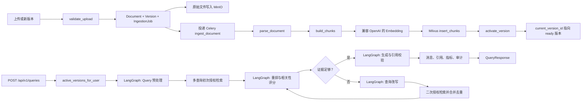

# RAG

本文只整理检索增强生成链路。认证、通用文档管理、UI 行为和部署细节只在它们影响 RAG 边界时提及。

## 范围

RAG 子系统包括：

- 文档校验、解析、切分、Embedding 和 Milvus 索引。
- 基于当前用户授权范围的活跃文档版本检索。
- 通过 LangGraph 编排的 LLM 相关性评分和答案生成。
- 引用、会话持久化、查询耗时指标和审计日志。

不包括 Streamlit UI 细节、通用账号管理，也不展开非查询业务 API；只有上传和版本接口作为索引入口时会被提到。

## 主要文件

- `app/api.py`：提供上传、版本上传接口并投递索引任务；`POST /api/v1/queries` 调用 `RAGService`。
- `app/services.py`：校验上传文件，创建文档版本和任务，写审计日志，并在索引成功后激活版本。
- `app/tasks.py`：Celery 文档入库和向量删除任务。
- `app/ingestion.py`：抽取文本并构建 chunk 元数据。
- `app/vector_store.py`：负责 Milvus collection schema、Embedding 调用、带过滤条件的检索、向量写入/删除和元数据同步。
- `app/repositories.py`：解析当前用户可访问的活跃文档版本。
- `app/rag.py`：LangGraph 工作流，包含授权检索、候选重排、相关性评分、查询改写、答案生成和引用校验。
- `app/models.py`：存储文档、版本、入库任务、会话、消息、引用、指标和审计日志。
- `app/config.py`：RAG、模型和索引相关配置。
- `tests/test_domain.py`：当前覆盖 chunk ID、相关性解析、上传校验和结构化拒答的单元测试。

## 数据流



## 入库路径

1. `app/api.py` 中的上传接口读取文件，校验归属和部门边界，创建文档版本与入库任务，上传原始文件到 MinIO，然后投递 `ingest_document`。
2. `ingest_document` 依次更新任务阶段：`parsing`、`embedding`、`indexing`、`activating`、`ready`。
3. `parse_document` 支持通过 `pypdf` 抽取 PDF 文本，也支持 UTF-8 文本和 Markdown。
4. `build_chunks` 使用 `RecursiveCharacterTextSplitter`，切分参数来自配置中的 `chunk_size` 和 `chunk_overlap`。
5. Chunk ID 是确定性的：`document_uuid:version_number:chunk_index`。
6. `MilvusChunkStore.insert_chunks` 对 chunk 文本做 Embedding，并写入向量和检索元数据。
7. `activate_version` 只在 Milvus 写入成功后设置 `Document.current_version_id`，因此索引失败不会覆盖旧的活跃版本。

## 检索和生成路径

1. `POST /api/v1/queries` 只接收 `question` 和可选的 `conversation_uuid`；客户端不能传部门 ID、文档 ID 或 Milvus 过滤表达式。
2. `RAGService.answer` 通过 `active_versions_for_user` 解析当前用户可访问的活跃版本。MySQL 是授权事实来源。
3. `preprocess_query` 在初次检索前按配置执行 Query 预处理，生成去重后的检索查询列表；用户原始问题保持不变，仍用于最终答案生成。
4. `retrieve` 对预处理后的查询逐个执行 Milvus 检索。`MilvusChunkStore.search` 对查询做 Embedding，并应用表达式：`version_uuid in [...]`。多查询结果按 `chunk_id` 合并，同一 chunk 保留最高分。
5. `grade_documents` 先按 `RERANKER_TYPE` 选择候选重排策略，然后按配置决定是否执行 LLM 相关性评分。内置默认重排会过滤空内容和可选低分候选、按标准化内容去重、按分数排序、限制单文档 chunk 数。
6. 如果相关证据不足且尚未补救，`rewrite_and_retrieve` 再次使用 Query 预处理器生成新的 corrective 查询，并且只在同一组授权版本 UUID 内二次检索。二次候选按 `chunk_id` 合并去重。
7. `generate` 只基于授权证据生成中文答案，并校验答案中的 `[n]` 引用。无引用或越界引用会严格重试一次；仍失败则返回 `refusal_reason = invalid_citations`。
8. `RAGService._citations` 只返回答案实际引用的 chunks，而不是全部候选证据。
9. 用户消息和助手消息会持久化，助手消息包含引用、模型名、`trace_id` 和耗时指标。
10. `query.execute` 审计日志记录 trace ID、是否拒答和引用数量。

## 授权不变量

- Milvus 检索前，先由 MySQL 解析出可访问的 version UUID，检索范围被这些 UUID 限定。
- 用户只能检索自己可访问的活跃文档版本。
- 管理员可访问所有未删除文档；其他用户可访问自己拥有的、部门可见的、用户 ACL 授权的或部门 ACL 授权的文档。
- 查询客户端无法扩大检索范围。
- 授权证据缺失或不足时，生成阶段返回结构化拒答，`refusal_reason = insufficient_authorized_evidence`。
- 查询改写不会访问外部网络，也不会改变授权版本集合。
- 答案缺少有效引用时返回结构化拒答，`refusal_reason = invalid_citations`。

## Query 预处理

`QUERY_REWRITE_TYPES` 支持按顺序组合以下类型：

| 策略 | 解决的核心问题 | 额外开销 | 适合场景 |
| --- | --- | --- | --- |
| `direct` | 口语化、指代不清、问题表达不完整 | 1 次 LLM 调用 | 用户问题较短、口语化或上下文表达不清 |
| `hyde` | 用户问题与知识库文档的表达风格差异较大 | 1 次 LLM 调用 | 专业知识库、文档语言与提问语言差异明显 |
| `step_back` | 具体问题需要背景知识、概念或原理支撑 | 1 次 LLM 调用 | 技术文档、规范、原理性问题 |
| `multi_query` | 单一查询角度覆盖不全 | 1 次 LLM 调用生成多个查询 | 答案涉及多个维度的复杂问题 |

此外还支持：

- `normalize`：本地规则清洗，去除首尾空白并合并连续空白，不调用 LLM。
- `standalone`：`direct` 的兼容别名，旧配置可继续使用。

预处理结果遵循以下规则：

- 第一项始终是规范化后的用户原问题。
- 查询按规范化文本去重。
- 初次检索最多使用 `QUERY_REWRITE_MAX_QUERIES` 个查询。默认启用 `normalize,direct,multi_query`，HyDE 和 Step-back 建议按知识库场景显式开启。
- corrective 检索最多使用 `QUERY_REWRITE_CORRECTIVE_MAX_QUERIES` 个尚未检索过的新查询。
- LLM 改写失败时保留规范化原问题，不中断 RAG 请求。
- 所有查询只用于检索；最终生成仍使用用户原始问题。

## Reranker 策略

`RERANKER_TYPE` 控制候选重排实现：

- `default`：默认策略。使用本地规则过滤、去重、按向量分数排序，并限制单文档 chunk 数。
- `identity`：不做重排，按检索返回顺序继续后续评分和生成，主要用于排障或对比实验。
- `external`：调用外部 reranker HTTP 接口，根据模型返回分数重排候选；接口失败或配置为空时回退到 `default` 策略。

外部 reranker 请求格式：

```json
{
  "model": "optional-reranker-model",
  "query": "用户问题",
  "documents": ["候选 chunk 文本 1", "候选 chunk 文本 2"]
}
```

响应支持 `results` 或 `data` 数组，每项至少包含候选下标和分数：

```json
{
  "results": [
    {"index": 1, "relevance_score": 0.98},
    {"index": 0, "relevance_score": 0.31}
  ]
}
```

鉴权使用 `RERANKER_API_KEY`，以 `Authorization: Bearer ...` 发送。

## Milvus Chunk 结构

每个已索引 chunk 包含：

- `chunk_id`
- `document_uuid`
- `version_uuid`
- `version_number`
- `department_uuid`
- `visibility`
- `page_number`
- `chunk_index`
- `source_name`
- `content`
- `embedding`

`department_uuid` 和 `visibility` 用于元数据同步和检查；查询检索的授权判断在 Milvus 搜索前由 MySQL 完成。

## 关键配置

- `LLM_API_KEY`, `LLM_BASE_URL`, `LLM_MODEL`
- `EMBEDDING_API_KEY`, `EMBEDDING_BASE_URL`, `EMBEDDING_MODEL`
- `EMBEDDING_DIMENSION`
- `RELEVANCE_MAX_CONCURRENCY`
- `RELEVANCE_GRADING_ENABLED`
- `QUERY_REWRITE_ENABLED`
- `QUERY_REWRITE_TYPES`
- `QUERY_REWRITE_MAX_QUERIES`
- `QUERY_REWRITE_CORRECTIVE_MAX_QUERIES`
- `RERANKER_TYPE`
- `RERANKER_ENDPOINT`
- `RERANKER_API_KEY`
- `RERANKER_MODEL`
- `RETRIEVAL_CANDIDATE_COUNT`
- `RETRIEVAL_MIN_SCORE`
- `RETRIEVAL_MAX_CHUNKS_PER_DOCUMENT`
- `FINAL_CONTEXT_COUNT`
- `CHUNK_SIZE`
- `CHUNK_OVERLAP`
- `MODEL_TIMEOUT_SECONDS`
- `MODEL_MAX_RETRIES`
- `RAG_CITATION_RETRY_COUNT`
- `RAG_MIN_RELEVANT_DOCUMENTS`
- `LANGSMITH_TRACING`, `LANGSMITH_HIDE_INPUTS`, `LANGSMITH_HIDE_OUTPUTS`

## 当前测试和缺口

当前直接覆盖 RAG 相关行为的测试包括：

- 确定性的 chunk ID。
- 上传校验。
- JSON 相关性解析。
- 无证据时的结构化拒答。
- `RAGService.answer` 在 fake vector store 和 fake model gateway 下的主链路。
- 授权版本 UUID 传递、消息持久化、完整 timings 持久化。
- 候选过滤、去重、排序和单文档 chunk 限额。
- Reranker 配置选择和外部 reranker 请求/排序。
- Query normalize、direct、HyDE、Step-back、多查询扩展、配置组合和结果去重。
- 初检前多查询授权检索，以及证据不足后的 corrective 查询扩展。
- 引用校验、严格重试、只返回实际引用 chunks 和 `invalid_citations` 拒答。
- 初次证据不足时的一轮查询改写、二次授权检索和候选合并去重。

建议补充：

- 覆盖 owner、department、显式 ACL、admin 路径下的授权版本过滤。
- 覆盖评分失败和熔断行为。
- 覆盖 chunks 指向已删除或不可访问文档时的引用组装。
- 增加带 opt-in 标记的 Milvus insert/search/delete 集成测试。
- 增加离线评估集，跟踪 Recall@K、引用准确率和事实一致性。
